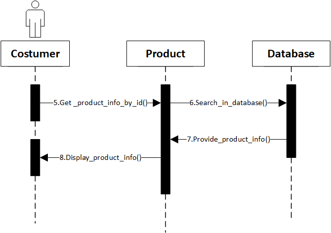
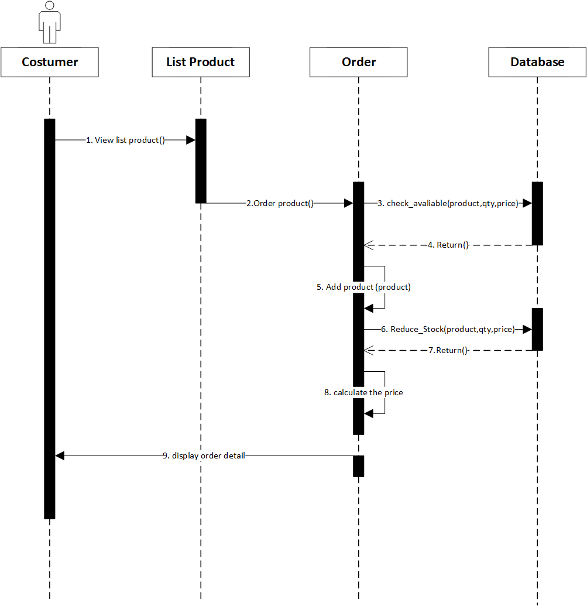
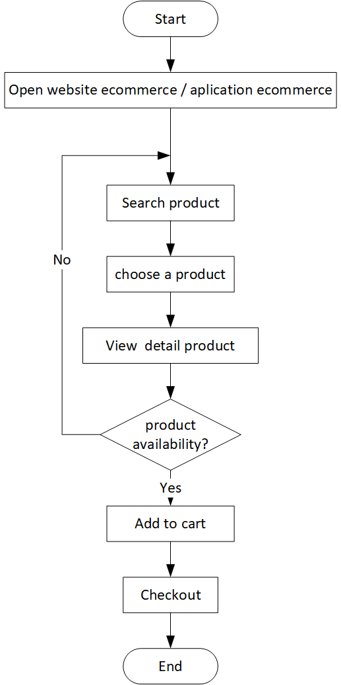

# E-Commerce Design Assigment

## :arrow_up: High Level Design


## :shopping_cart: Product Detail

### Sequence diagram Product detial



## :shopping_cart: Create Order



## flowchart



```pseudocode
CreateOrder() {
  let totalCost = calculatePrice(cart)
  let payment = usePaymentAPI(totalcost)

  if (payment.isSuccessful) {
    updateStock(cart)

    return "Order Created"
  } else {
    return "Order Failed"
  }
}

calculatePrice(cart) {
  let totalPrice = 0
  for each product in cart:
    totalPrice = product.price * product.quantity

  return totalPrice
}

updateStock(cart) {
  for each product in cart:
    let item = getDatabaseItemById(product.Id)
    item.stock -= product.qunatity
}
```

- `CreateOrder()` is the main function that runs other operations within it. For the `payment` variable, it is assumed the process is done through an external program/application and returns a boolean value after completion.
- `calculatePrice()` uses a loop to calculate the total price of products within the cart and returns it, so the complexity of this calculation is $O(n)$.
- `updateStock()` also uses a loop to update item stocks by reducing it with the amount of purchased products. Assuming `getDatabaseItemById()` is a function with a complexity of $O(1)$ for the best case and $O(n)$ in the worst case, then the total complexity for `updateStock()` function is $O(n)$ for the best result and $O(n^2)$ in worst cases.
